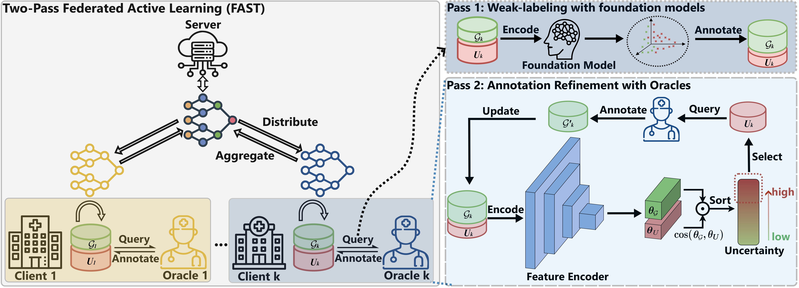
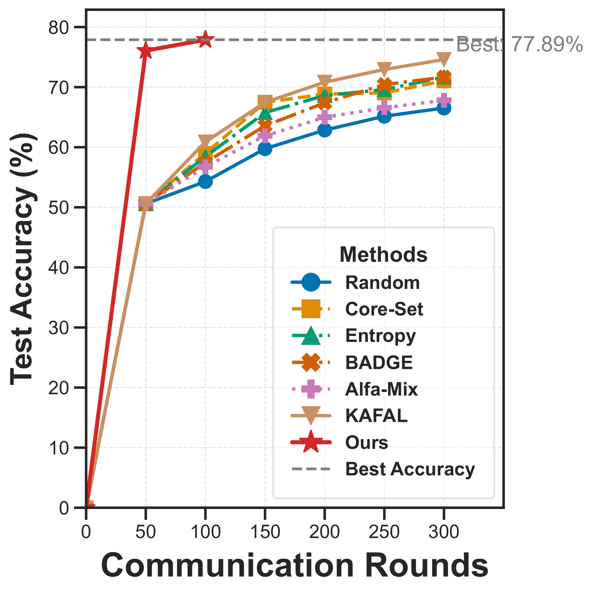
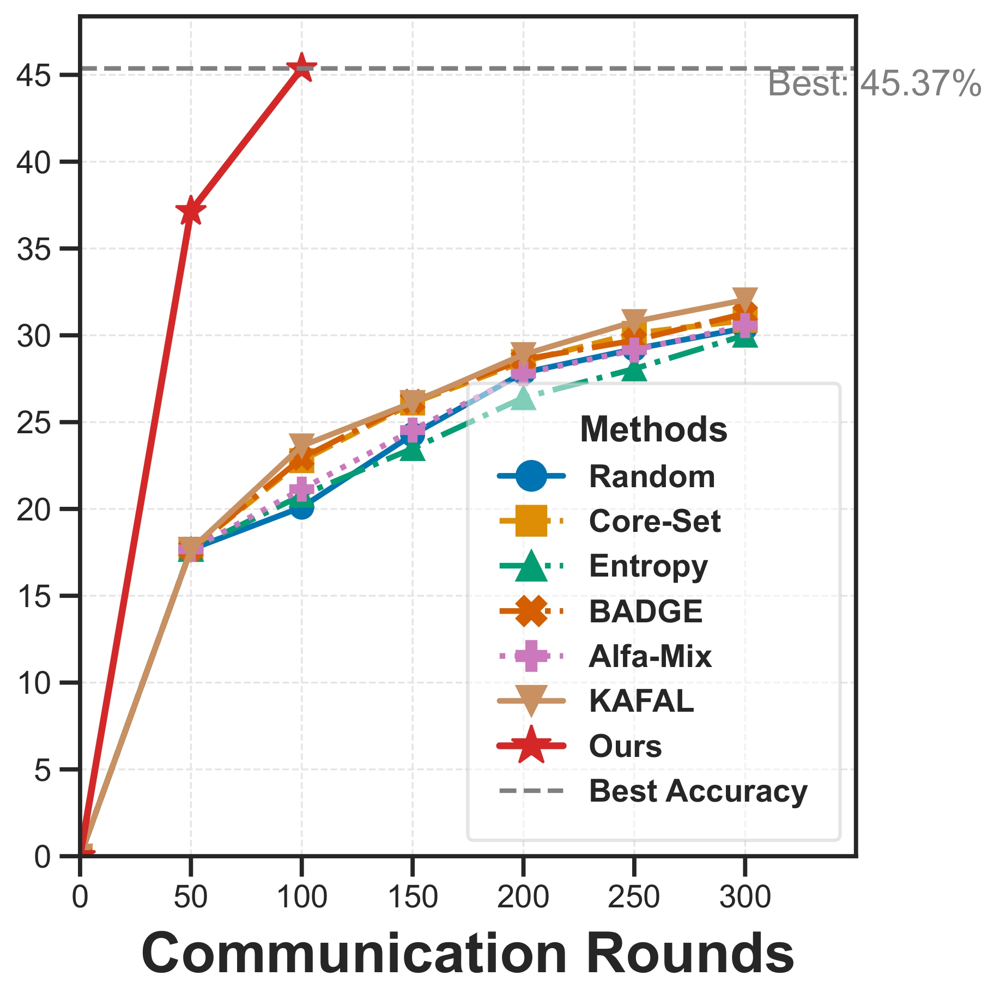

# FAST: Federated Active Learning with Foundation Models for Communication-efficient Sampling and Training

<div align="center">

<div>
    <a href='https://www.linkedin.com/in/haoyuan-li-cs9654/' target='_blank'>Haoyuan Li</a><sup>1</sup>&emsp;
    <a href='https://mathias-funk.com/' target='_blank'>Mathias Funk</a><sup>1</sup>&emsp;
    <a href='https://jd92.wang/' target='_blank'>Jindong Wang</a><sup>2</sup>&emsp;
    <a href='https://aqibsaeed.github.io/' target='_blank'>Aaqib Saeed</a><sup>1</sup>&emsp;
</div>
<div>
<sup>1</sup>Eindhoven University of Technology&emsp;
<sup>2</sup>College of William & Mary&emsp;
</div>
</div>

<div align="center">

[](https://arxiv.org/abs/2504.03783)
[](https://ieeexplore.ieee.org/abstract/document/11008538)

</div>

## 📝 Abstract

FAST is a two-pass federated active learning framework that reduces communication costs by **8x** while achieving **4.36% higher accuracy** than existing methods. We leverage foundation models for weak labeling, followed by human refinement of uncertain samples, using only **5% labeling budget**.

<div align="center">

<p><em>Overview of FAST: Two-pass federated active learning framework</em></p>
</div>

## 🌟 Key Features

- **Two-Pass Strategy**: Foundation model weak labeling + human refinement
- **8x Communication Reduction**: Fewer rounds, lower costs
- **Superior Performance**: 4.36% average improvement over baselines
- **Minimal Annotation**: Only 5% labeling budget required

## 🚀 Quick Start

### Installation
```bash
pip install torch torchvision numpy flwr transformers
git clone https://github.com/Haoyuan-L/FAST-official.git
cd FAST-official
```

### Basic Usage
```bash
# CIFAR-10 with default settings
python main.py

```

## 📊 Results

### Performance and Communication Efficiency Comparison

| Method | CIFAR-10 |  |  | CIFAR-100 |  |  | SVHN |  |  |
|--------|----------|----------|----------|-----------|----------|----------|----------|----------|----------|
|        | Acc. (%) | Comm. Cost (MB) | Walltime (s) | Acc. (%) | Comm. Cost (MB) | Walltime (s) | Acc. (%) | Comm. Cost (MB) | Walltime (s) |
| Random | 69.14 | 7090.94 | 30398.95 | 32.67 | 8502.69 | 37258.75 | 85.47 | 6969.79 | 58064.42 |
| LoGo   | 71.92 | 7090.94 | 32709.14 | 34.27 | 8502.69 | 39268.24 | 87.08 | 6969.79 | 61638.97 |
| **FAST** | **77.16** ↑ | **902.54** (↓87.3%) | **7342.52** (↓76.7%) | **41.94** ↑ | **1079.56** (↓87.3%) | **15104.38** (↓60.5%) | **88.79** ↑ | **896.72** (↓87.1%) | **19178.83** (↓68.0%) |

*FAST uses 1 AL round (100 FL rounds) vs. baselines using 8 AL rounds (800 FL rounds)*

### Experimental Results on CIFAR-10 and CIFAR-100

<div align="center">


<p><em>Left: CIFAR-10 results. Right: CIFAR-100 results. FAST achieves superior performance with significantly fewer communication rounds.</em></p>
</div>

## 🔧 Configuration

Key parameters:
- `--dataset`: [cifar10, cifar100, svhn, pathmnist, dermamnist]
- `--foundation_model`: [siglip, clip, evaclip, dinov2]
- `--budget`: Labeling budget (default: 0.05)
- `--num_clients`: Number of clients (default: 10)

## 📜 Citation

```bibtex
@article{li2025fast,
  title={FAST: Federated Active Learning with Foundation Models for Communication-efficient Sampling and Training},
  author={Li, Haoyuan and Funk, Mathias and Wang, Jindong and Saeed, Aaqib},
  journal={arXiv preprint arXiv:2504.03783},
  year={2025}
}
```

## 📧 Contact

**Haoyuan Li**: [h.y.li@tue.nl](mailto:h.y.li@tue.nl) | [Issues](https://github.com/Haoyuan-L/FAST-official/issues)
